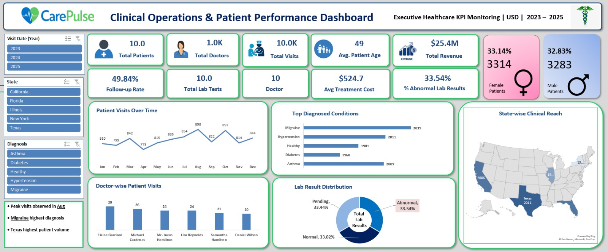
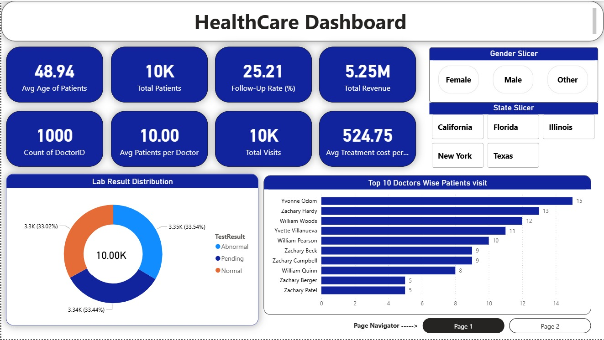
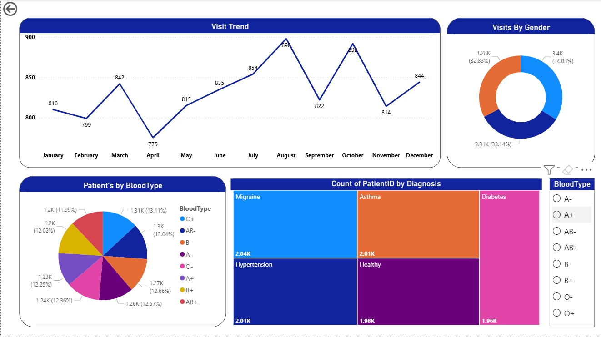
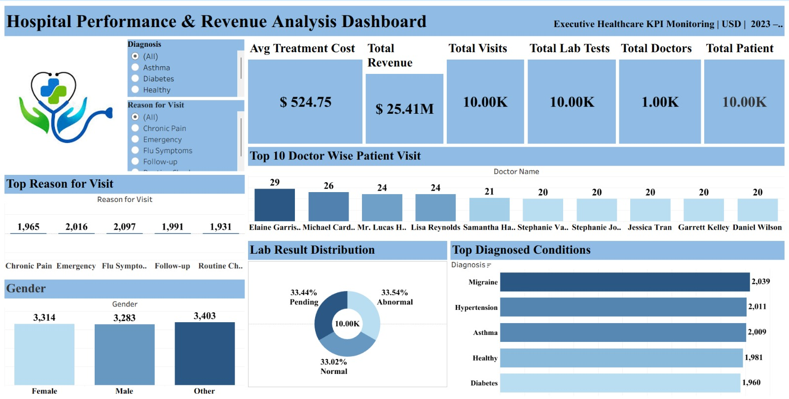

## 📊 Healthcare Analytics Dashboard Project

### 🔹 Overview

This project focuses on analyzing healthcare data to monitor patient performance, hospital operations, and revenue insights using Excel, Power BI, Tableau, and MySQL.

---

### 🔹 Tools & Technologies Used

* Microsoft Excel
* Power BI
* Tableau
* MySQL

---

### 🔹 Dashboard Preview

#### 📌 Excel Dashboard

#### 📌 Power BI Dashboard

#### 📌 Tableau Dashboard

---

### 🔹 SQL Queries

All SQL queries used for analysis are available here:  
[📂 View SQL Queries](healthcare_queries.sql)

---

### 🔹 Key Insights

* Peak patient visits observed in August
* Migraine is the most diagnosed condition
* Balanced lab results distribution
* Texas has the highest patient volume

---

### 🔹 Project Highlights

* End-to-end data analysis project
* Data cleaning and transformation
* Interactive dashboard creation
* SQL-based data extraction and insights

---

### 🔹 Author

**Syed Saad Hassan**

